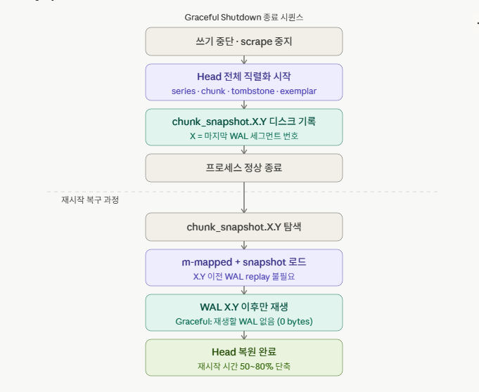
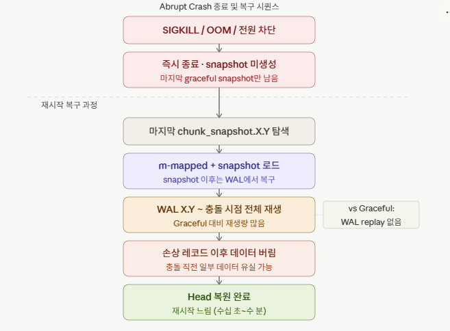

## Graceful Shutdown
언제 발생하나?

사용자가 SIGTERM 신호를 보내거나 서비스를 정상적으로 중단할 때 발생합니다.

Crash와 가장 큰 차이점은 snapshot을 촬영합니다.
HeadBlock에 머물러 있으나 아직 Disk에 Write가 되지 않은 Active Chunck를 Disk에 snapshot 형태로 저장합니다.

### snapshot에 대해서.
v2.30.0+ 버전의 프로메테우스 버전부터는 `--enable-feature=memory-snapshot-on-shutdown` 로 인해
Graceful Shutdown 시 자동으로 생성되며 Head block의 in-memory 상태 전체를 직렬화합니다.
이 목적은 기존의 재시작 시 WAL replay를 완전히 건너뛰기 위함입니다.
반면 , Crash 시에 crash 이후에도 직전 Graceful Shutdown의 chunk_snapshot이 남아있습니다.
재시작 시 그 snapshot 지점까지는 복구하고, 그 이후 WAL만 replay하게 됩니다.

### snapshot 도입 배경
프로메테우스는 디스크의 영구 블록(Persistent Block)으로 압축되지 않은 최신 시계열 데이터는 메모리 상의 Head Block에 상주합니다. 
이때 예기치 않은 종료나 크래시가 발생했을 때 데이터 유실을 막기 위해, 모든 변경 사항은 디스크의 WAL(Write-Ahead Log) 에 순차적으로 기록됩니다.

과거 버전에서는 프로메테우스가 재시작할 때마다 이 WAL을 처음부터 끝까지 다시 읽어들여(Replay) Head Block을 메모리에 재구성해야 했습니다. 
수많은 컨테이너와 노드에서 대량의 메트릭을 수집하는 환경에서는 이 WAL Replay 과정에 막대한 CPU 연산과 I/O 리소스가 소모되었고, 길게는 수십 분 이상의 가동 중단(Downtime)이 발생하기도 합니다.

이러한 고질적인 문제를 해결하기 위해 도입된 메커니즘이 바로 메모리 스냅샷입니다.

종료(Graceful Shutdown) 시: 프로메테우스 서버가 정상적으로 종료될 때, 현재 메모리에 들고 있는 Head Block 데이터를 디스크에 '스냅샷' 파일 형태로 그대로 덤프하여 저장합니다.

시작(Startup) 시: 프로메테우스가 다시 구동될 때, 길고 무거운 WAL Replay 과정을 완전히 건너뛰고 저장해둔 메모리 스냅샷을 즉각적으로 메모리에 로드합니다.
이를 통해 설정 변경이나 유지보수로 인해 불가피하게 데몬을 재시작해야 할 때, 메트릭 수집의 블라인드 타임을 극적으로 단축할 수 있습니다.

### Graceful Shutdown 시 WAL 처리
종료 시퀀스가 실행되면서 메모리의 head chunk에 있는 데이터를 WAL에 완전히 플러시합니다.
WAL 세그먼트를 정상적으로 닫고, chunks_head 디렉터리에 있는 m-mapped chunk도 안전하게 닫습니다. 
재시작 시 WAL replay가 필요 없거나 매우 짧습니다.

## Abrupt Crash
언제 발생하나?

전원 차단, SIGKILL 신호, 또는 소프트웨어 오류(Panic)로 인해 프로세스가 갑자기 중단되는 경우합니다.

## Abrupt Crash 시 WAL 처리

메모리에 있던 데이터 중 WAL에 아직 기록되지 않은 부분은 유실되며, WAL의 마지막 세그먼트가 불완전한 상태한 상태로 남을 수 있습니다.
재시작 시 Prometheus는 WAL을 처음부터 replay하며 유효한 레코드까지만 복구하고, 손상된 레코드 이후는 버립니다. 

### 왜 종료시에만 snapshot을 남기는가?
Prometheus의 snapshot은 증분(incremental)이 아닌 전체(full) 직렬화입니다.
snapshot을 찍을 때마다 Head block에 현재 존재하는 모든 series의 모든 in-memory chunk를 통째로 직렬화합니다.
예를 들어 30분 마다 snapshot을 찍는다면? 수십 GB/h의 I/O가 추가로 발생합니다.
결정적으로, WAL이 이미 충돌 내구성을 담당하고 있습니다.

