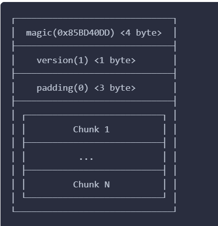
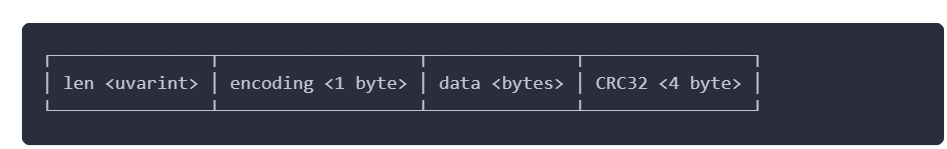
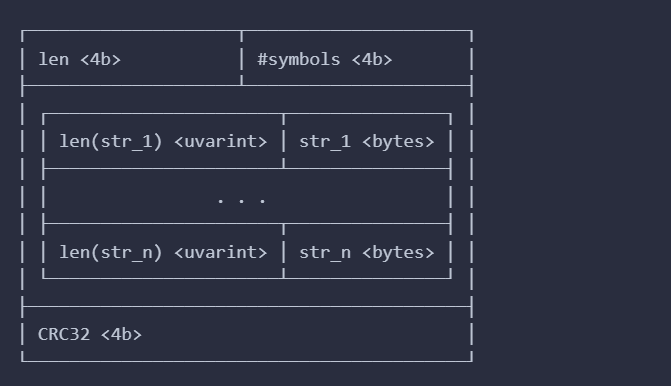
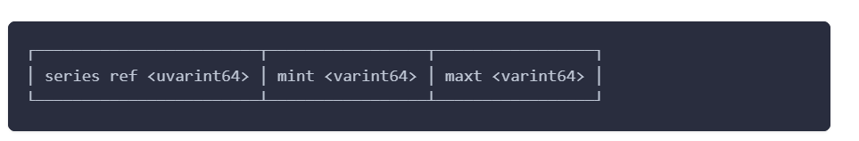

## 가변 길이 정수

### 가변 길이 정수란 무엇인가?

쉽게 설명하자면 **숫자의 크기에 따라 사용하는 바이트 수를 조절하는 방식** 이다.
프로메테우스는 Go 언어로 개발되었기 때문에 Go의 가변 길이 정수 타입인 uvarint를 사용하여 이를 구현한다.

### 프로메테우스에서는 어떻게 쓰이는가?

프로메테우스의 영구 블록은 4개의 구분으로 이루어집니다.  
meta.json(파일): 블록의 메타데이터.  
chunks(디렉토리): 청크에 대한 메타데이터 없이 원시 청크를 포함합니다.  
index(파일): 이 블록의 인덱스입니다.  
tombstones(파일): 블록 조회 시 샘플을 제외하기 위한 삭제 마커.  

여기서 chunks 디렉터리 안의 파일들은 meta.json 을 제외한 모든 구성에 적용된다.  

청크에서의 varint

index에서의 varint

tombstone에서의 varint

가변길이 정수의 핵심은 데이터의 크기를 표현할때 데이터의 크기에 따라 바이트를 절약할 수 있다는 것이다.

chunk로 예를 들어보자 데이터의 크기가 65 바이트인 청크를 저장해본다고 생각해보자.
만약 고정 길이 변수고 int32를 사용하여 4바이트를 저장한다고 하면 앞에 3바이트는 전혀 값이 없음에도 낭비되게 된다.

[00000000] [00000000] [00000000] [01000001] 

만약 가변 길이 정수를 사용한다면? 

[01000001] 

1 바이트면 충분하다. 앞자리의 0은 뒤에 이지는 바이트의 유무를 나타낸다.
만약 128바이트 이상이라면 ? 

[10100111] [00000001]

167바이트인 데이터의 가변 길이정수이다. 맨 첫 비트에 1을 새겨넣음으로써 뒤에 비트가 바이트가 더 온다는 것을 알 수 있다.

### 왜 쓰는가?

프로메테우스는 초당 수백만 개의 시계열 데이터를 수집하고 이를 수많은 청크로 쪼개어 저장한다.  
티끌 모아 태산: 만약 1,000만 개의 청크가 있다고 가정해 보면,  
고정 길이를 쓰면: 데이터 길이 표기(4바이트)에만 약 40MB가 필요하다.  
가변 길이를 쓰면: 데이터 길이 표기(1바이트)에 단 10MB만 필요하다. 여기서만 30MB의 디스크와 메모리를 아낄 수 있습니다.

## Series 섹션 내 타임스탬프와 청크 위치의 "델타(Delta) 인코딩

compression wiki의 Delta Encoding 참조

## 툼스톤에서의 가변길이 정수

series ref <uvarint64>: 부호가 없는(Unsigned) 가변 길이 정수

어떤 시계열 데이터(Series)를 삭제할 것인지 가리키는 고유 ID(참조 번호)

mint <varint64>: 부호가 있는(Signed) 가변 길이 정수

maxt <varint64>: 부호가 있는(Signed) 가변 길이 정수 

mint는 삭제를 시작할 시간(Minimum Time), maxt는 삭제를 끝낼 시간(Maximum Time)

이 역시 가변길이 정수를 통해서 효과적으로 데이터의 크기를 압축한다.