# Prometheus TSDB - Part 5: Queries 관측 실습

## 환경 세팅

### 실습 환경

- Oracle Cloud Ubuntu ARM64 VM, Docker

### docker-compose.yml

```yaml
services:
  prometheus:
    image: prom/prometheus:latest
    container_name: prometheus
    ports:
      - "9090:9090"
    volumes:
      - ./prometheus.yml:/etc/prometheus/prometheus.yml
      - prometheus_data:/prometheus
    command:
      - '--config.file=/etc/prometheus/prometheus.yml'
      - '--storage.tsdb.min-block-duration=10m'
      - '--storage.tsdb.max-block-duration=10m'
      - '--storage.tsdb.retention.time=1h'
      - '--web.enable-lifecycle'

  node_exporter:
    image: prom/node-exporter:latest
    container_name: node_exporter
    ports:
      - "9100:9100"

volumes:
  prometheus_data:
```

### prometheus.yml

```yaml
global:
  scrape_interval: 5s

scrape_configs:
  - job_name: 'prometheus'
    static_configs:
      - targets: ['localhost:9090']

  - job_name: 'node_exporter'
    static_configs:
      - targets: ['node_exporter:9100']
```

```bash
docker compose up -d
```

> persistent block이 최소 1개 이상 생성되어야 의미 있는 관측이 가능하다.
> `min-block-duration=10m` 이므로 약 15분 이상 기다린 뒤 실습을 진행했다.

---

## Step 1. TSDB 쿼리 API와 매처(Matcher) 증명

TSDB의 3가지 쿼리 타입은 Prometheus HTTP API로 직접 호출할 수 있다.

### 1-1. LabelNames() — 모든 레이블 이름 조회

```bash
curl -s http://localhost:9090/api/v1/labels | python3 -m json.tool
```

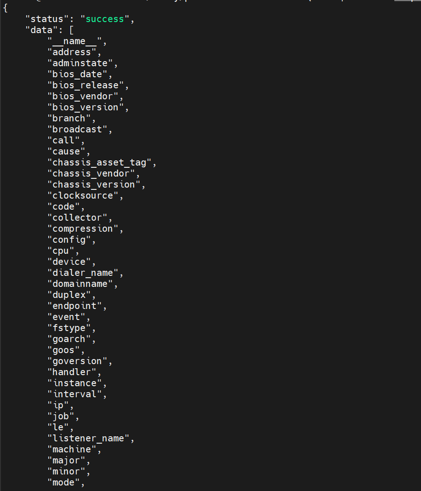

이 API가 내부적으로 호출하는 것이 바로 `LabelNames()`이다.
인메모리 맵(`map[labelName][]postingOffset`)의 키를 순회하여 정렬된 레이블 이름 목록을 반환한다.

> Grafana에서 레이블 이름을 타이핑하면 나타나는 자동완성 드롭다운때 사용된다.

---

### 1-2. LabelValues(name) — 특정 레이블의 값 목록 조회

```bash
# "job" 레이블의 모든 값
curl -s http://localhost:9090/api/v1/label/job/values | python3 -m json.tool
```

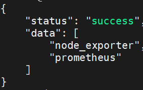

```bash
# "__name__" 레이블의 값 = 모든 메트릭 이름
curl -s 'http://localhost:9090/api/v1/label/__name__/values' | python3 -m json.tool | head -20
```

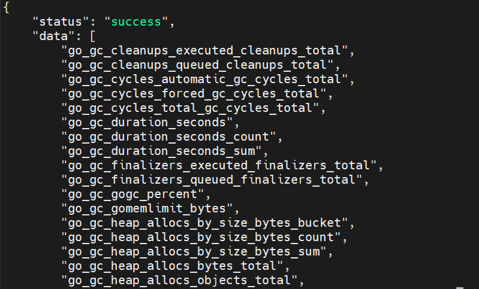

내부적으로 `LabelValues(name)`을 호출한다.
인메모리 맵에서 해당 레이블의 첫 번째/마지막 오프셋을 찾고, Postings Offset Table을 순회하여 모든 레이블 값을 반환한다.

---

### 1-3. Select([]matcher) — 매처로 시계열 샘플 조회

```bash
curl -s -g 'http://localhost:9090/api/v1/query?query=up{job="prometheus"}' | python3 -m json.tool
```

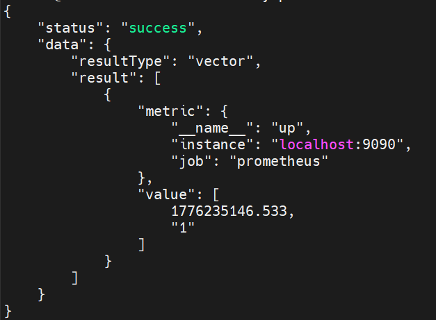

PromQL 엔진이 내부적으로 `Select([__name__="up", job="prometheus"])`를 호출한다.
각 매처에 대한 포스팅 리스트를 구한 뒤 **교집합(intersection)**으로 최종 시계열 ID를 확보하고, 해당 시계열의 청크에서 샘플을 읽어오는 과정이다.

---

### 1-4. 4종 매처 비교

```bash
# Equal (=)
curl -s -g 'http://localhost:9090/api/v1/query?query=up{job="prometheus"}' | python3 -m json.tool

# Not Equal (!=)
curl -s -g 'http://localhost:9090/api/v1/query?query=up{job!="prometheus"}' | python3 -m json.tool

# Regex Equal (=~)
curl -s -g 'http://localhost:9090/api/v1/query?query=up{job=~"pro.*"}' | python3 -m json.tool

# Regex Not Equal (!~)
curl -s -g 'http://localhost:9090/api/v1/query?query=up{job!~"node.*"}' | python3 -m json.tool
```

**각 매처의 내부 동작:**

- `=` → Postings Offset Table에서 해당 항목을 **직접 조회**
- `=~` → 모든 레이블 값을 순회하며 정규식 매칭 → 결과 **합집합(union)**
- `!=` → Equal의 포스팅을 구한 뒤 **차집합(subtraction)**
- `!~` → Regex Equal의 포스팅을 구한 뒤 **차집합**

```json
// query=up{job="prometheus"}
{
    "status": "success",
    "data": {
        "resultType": "vector",  // resultType이 vector라는 것은 특정 시점의 상태 값이라는 뜻
        "result": [
            {
                "metric": {
                    "__name__": "up",
                    "instance": "localhost:9090",
                    "job": "prometheus"
                },
                "value": [1776236221.254, "1"]
            }
        ]
    }
}

// query=up{job!="prometheus"}
{
    "status": "success",
    "data": {
        "resultType": "vector",
        "result": [
            {
                "metric": {
                    "__name__": "up",
                    "instance": "node_exporter:9100",
                    "job": "node_exporter"
                },
                "value": [1776236230.944, "1"]
            }
        ]
    }
}

// query=up{job=~"pro.*"}
{
    "status": "success",
    "data": {
        "resultType": "vector",
        "result": [
            {
                "metric": {
                    "__name__": "up",
                    "instance": "localhost:9090",
                    "job": "prometheus"
                },
                "value": [1776236247.458, "1"]
            }
        ]
    }
}

// query=up{job!~"node.*"}
{
    "status": "success",
    "data": {
        "resultType": "vector",
        "result": [
            {
                "metric": {
                    "__name__": "up",
                    "instance": "localhost:9090",
                    "job": "prometheus"
                },
                "value": [1776236254.411, "1"]
            }
        ]
    }
}
```

---

### 1-5. 부정 매처 단독 사용 시 에러 확인

**"독립적인 부정 매처만으로는 쿼리를 실행할 수 없다"의 검증**

**시도1:**

```bash
# 부정 매처만 단독 사용 → 에러!
curl -s -g 'http://localhost:9090/api/v1/query?query={job!="prometheus"}' | python3 -m json.tool
```

**결과1:**

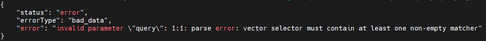

**시도2:**

```bash
# 정규식 부정 매처 단독 → 동일 에러
curl -s -g 'http://localhost:9090/api/v1/query?query={job!~"prom.*"}' | python3 -m json.tool
```

**결과2:**

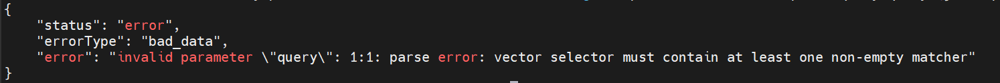

**왜 에러인가?**

부정 매처만 쓰면 "일치하지 않는 모든 것"을 구해야 하는데, 이는 거의 **전체 시계열을 풀 스캔**하는 것이다.
반드시 긍정 매처(`=`, `=~`)로 먼저 결과 집합을 줄인 뒤, 차집합으로 부정 조건을 적용해야 한다.
(prometheus 내부적으로 부정 매처의 단독 사용을 막는다.)

---

### 1-6. count()로 교집합/차집합 상보 관계 검증

```bash
# 전체 up 시계열 수
curl -s -g 'http://localhost:9090/api/v1/query?query=count(up)' | python3 -m json.tool

# job="prometheus"인 up 시계열 수
curl -s -g 'http://localhost:9090/api/v1/query?query=count(up{job="prometheus"})' | python3 -m json.tool

# job!="prometheus"인 up 시계열 수
curl -s -g 'http://localhost:9090/api/v1/query?query=count(up{job!="prometheus"})' | python3 -m json.tool
```

**확인 포인트:** `count(up{job="prometheus"})` + `count(up{job!="prometheus"})` = `count(up)`

= 와 != 매처의 결과가 전체 집합을 올바르게 분할함을 확인했다.

```json
// query=count(up)          → "2"
// query=count(up{job="prometheus"})   → "1"
// query=count(up{job!="prometheus"})  → "1"
// 검증: 1 + 1 = 2 ✓
```

---

## Step 2. `promtool`로 Persistent Block 인덱스 해부

Python 스크립트 없이, Prometheus에 내장된 `promtool`을 사용하여 인덱스 구조를 확인한다.

### 2-1. Persistent Block 디렉토리 확인

```bash
docker exec prometheus ls -la /prometheus/data
```

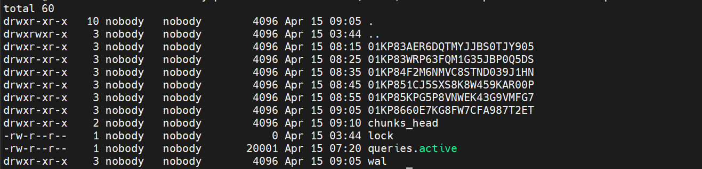

ULID 형식(예: `01kp7...`)의 디렉토리가 persistent block이다.

```bash
# 블록 이름을 변수에 저장 (이후 실습에서 계속 사용하므로 진행시 참고)
BLOCK=$(docker exec prometheus sh -c 'ls /prometheus/data | grep -E "^[A-Z0-9]{26}$" | head -1')
echo "블록: $BLOCK"
```

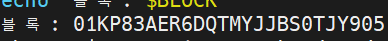

`/prometheus/data` 하단에 있는 ULID 형식 하나를 가져와 변수 `$BLOCK`에 저장해서 향후 실습을 편하게 진행할 수 있도록 한다.

```bash
# 블록 내부 구조
docker exec prometheus ls -la /prometheus/data/$BLOCK/
```

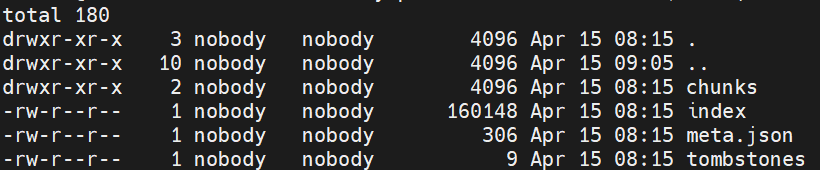

`chunks/`, `index`, `meta.json`, `tombstones` 구조가 보인다.

---

### 2-2. meta.json으로 블록 정보 확인

```bash
docker exec prometheus sh -c "cat /prometheus/data/$BLOCK/meta.json" | python3 -m json.tool
```

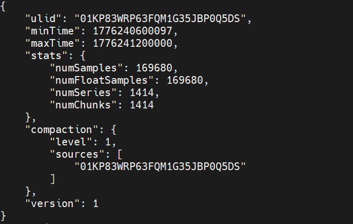

**확인 사항:**

- `minTime`, `maxTime` : 블록이 포함하는 시간 범위
- `stats.numSeries` : 시계열 수
- `stats.numChunks` : 청크 수
- `stats.numSamples` : 샘플 수

**추가 사항:**

- 블록 생성을 10분으로 단축하고 1시간 뒤 삭제되도록 prometheus에 설정되어 있기 때문에 블록의 수정(변경, 삭제)이 빠르다.
- 따라서 지속적으로 `BLOCK` 변수에 ULID명을 넣어주는 것이 좋다. (실습을 진행하며)

---

### 2-3. index 파일 헤더 — Magic Number (xxd)

```bash
# BLOCK 변수 최신화
BLOCK=$(docker exec prometheus sh -c 'ls /prometheus/data | grep -E "^[A-Z0-9]{26}$" | head -1')

# 해당 ULID 경로의 index 파일 확인
docker exec prometheus sh -c "xxd /prometheus/data/$BLOCK/index | head -3"
```

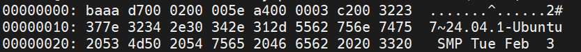

**확인 사항:**

- 첫 4바이트: `ba aa d7 00` → Magic Number (`0xBAAAD700`)
- 5번째 바이트: `02` → Version 2

> `chunks_head`의 Magic Number(`0x0130BC91`)와 다르다. 인덱스 파일 전용 매직 넘버이다.
> `MagicIndex = 0xBAAAD700`

---

### 2-4. `promtool tsdb analyze` — 인덱스 구조의 핵심 분석

Python으로 바이너리를 직접 파싱할 필요 없이, Prometheus가 자신의 인덱스를 해석한 결과를 보여준다.

```bash
# BLOCK변수에 ULID 담기
BLOCK=$(docker exec prometheus sh -c 'ls /prometheus/data | grep -E "^[A-Z0-9]{26}$" | head -1')

# promtool로 자신의 인덱스 해석 결과 확인하기
docker exec prometheus promtool tsdb analyze /prometheus/data/ $BLOCK
```

```
Block ID: 01KP851CJ5SXS8K8W459KAR00P
Duration: 9m59.903s
Total Series: 1414
Label names: 62
Postings (unique label pairs): 925
Postings entries (total label pairs): 5762

Label pairs most involved in churning:
7 job=prometheus
7 instance=localhost:9090
4 job=node_exporter
4 instance=node_exporter:9100
...

Most common label pairs:
913 job=prometheus
913 instance=localhost:9090
501 job=node_exporter
501 instance=node_exporter:9100
110 __name__=prometheus_http_request_duration_seconds_bucket
...

Highest cardinality labels:
562 __name__
88 le
59 handler
46 collector
...
```

**분석 결과 해석:**

- **`Label names: 62`**
  TSDB 엔진의 인메모리 맵(Map) 키를 순회했을 때 얻는 레이블 이름의 총개수이다. 쿼리 API `LabelNames()`를 호출했을 때 반환되는 리스트의 길이와 정확히 일치한다.

- **`Postings (unique label pairs): 925`**
  Postings Offset Table의 전체 엔트리 수이다. `job=prometheus`, `device=eth0` 등 총 925개의 고유한 '키=값' 쌍이 존재하며, 각각이 925개의 포스팅 리스트를 가리키고 있다.

- **`Most common label pairs` (포스팅 리스트가 큰 레이블 쌍)**
  로그 결과: `job="prometheus" : 913`
  이 레이블 쌍의 포스팅 리스트 안에 무려 **913개의 시계열 ID**가 들어있다는 뜻이다. 즉, `Select([job="prometheus"])` 쿼리를 날리면 전체 1,414개의 시계열 중 저 913개만 필터링되어 반환된다.

- **`Highest cardinality labels` (카디널리티가 높은 레이블)**
  로그 결과: `__name__ : 562`
  `__name__`(메트릭 이름)이라는 단일 레이블 하나에만 562개의 고유한 값이 매달려 있다는 뜻이다. `LabelValues("__name__")`의 결과 길이와 일치한다.
  만약 특정 레이블(예: `user_id`)의 카디널리티가 수백만 개로 폭증하면 Postings Offset Table이 비대해져 **OOM(메모리 초과) 장애**가 발생한다.

---

### 2-5. `promtool tsdb dump --match` — Select() 동작을 텍스트로 확인

`--match` 옵션을 주면, `Select([]matcher)`와 동일한 동작을 수행한다.

```bash
# up{job="prometheus"} 매처로 Select — 시계열 + 샘플 확인
docker exec prometheus promtool tsdb dump \
  --match='up{job="prometheus"}' \
  /prometheus/data 2>/dev/null | head -10
```

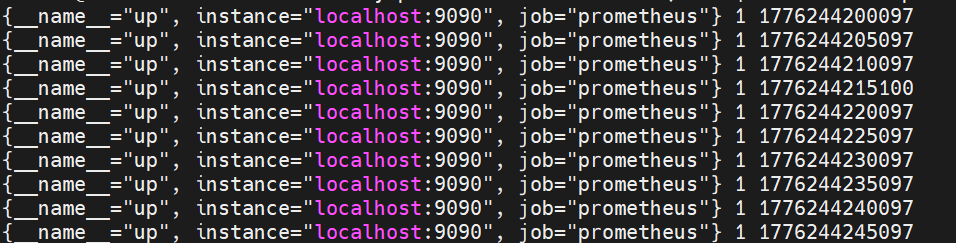

`{시계열 식별자(레이블 세트)}` + `측정값(Sample Value)` + `수집시간(Timestamp)` 형식의 데이터를 tsdb 엔진이 직접 꺼내온 모습을 확인할 수 있다.

---

## Step 3. 복수 블록 쿼리와 N-way Merge 관측

### 3-1. 현재 블록 목록과 시간 범위

디스크에 존재하는 영구 블록들의 메타데이터(시간 범위, 샘플 수 등)를 확인한다.

```bash
# promtool을 사용한 전체 블록 리스트 조회
docker exec prometheus promtool tsdb list -r /prometheus/data/
```

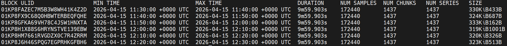

출력되는 표(Table)를 통해 각 블록의 ULID, Min Time, Max Time, 시계열(Series) 및 샘플(Sample) 수를 직관적으로 확인할 수 있다.

---

### 3-2. 로드된 블록 수 메트릭

현재 Prometheus 엔진이 메모리에 로드하여 쿼리에 참여시킬 수 있는 전체 블록의 수를 확인한다.

```bash
curl -s -g 'http://localhost:9090/api/v1/query?query=prometheus_tsdb_blocks_loaded' | python3 -m json.tool
```

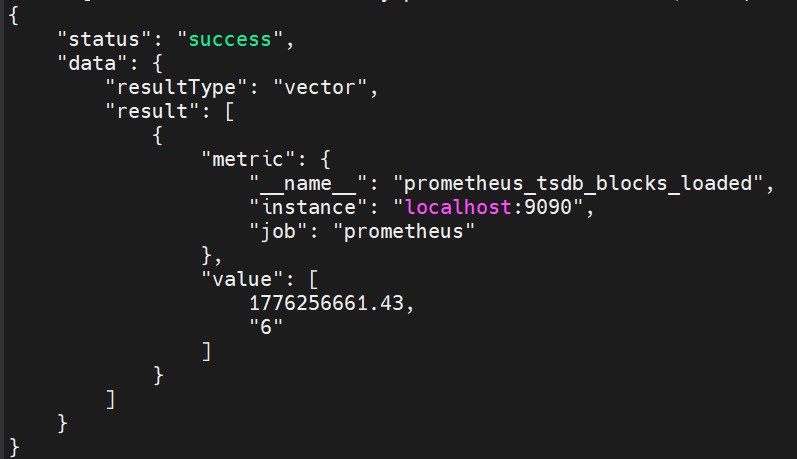

---

### 3-3. 시간 범위에 따른 샘플 수 변화

시간 범위를 다르게 하여 `query_range` API를 호출하고, 반환되는 샘플의 수를 비교한다.

```bash
# 1. 최근 5분 쿼리 (1~2개 블록 참조)
curl -s -g "http://localhost:9090/api/v1/query_range?query=up{job=\"prometheus\"}&start=$(date -d '5 minutes ago' +%s)&end=$(date +%s)&step=15s" \
  | python3 -c "
import sys, json
data = json.load(sys.stdin)
for r in data['data']['result']:
    print(f' 샘플 수: {len(r[\"values\"])}개')
"

# 2. 최근 30분 쿼리 (여러 블록 참조)
curl -s -g "http://localhost:9090/api/v1/query_range?query=up{job=\"prometheus\"}&start=$(date -d '30 minutes ago' +%s)&end=$(date +%s)&step=15s" \
  | python3 -c "
import sys, json
data = json.load(sys.stdin)
for r in data['data']['result']:
    print(f' 샘플 수: {len(r[\"values\"])}개')
"
```

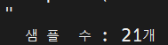
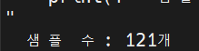

**관측 포인트:**

- 쿼리하는 시간 범위(Time Range)가 넓어질수록 더 많은 과거 블록(Persistent Block)이 쿼리에 참여하게 되며, 반환되는 샘플 수가 증가한다.
- 이때 TSDB 내부적으로는 **Merge Querier**가 동작하여 각 블록의 Querier가 가져온 데이터를 **N-way Merge(다중 병합)** 방식으로 정렬하고 합산하여 최종 결과를 만들어낸다.
