## fs.file-max와 ulimit를 통한 다수 Block 동시 쿼리 시 FD 고갈

쿼리가 여러 persistent block에 걸쳐 N-way merge를 수행할 때, 각 block의 chunk 파일 FD를 동시에 열어야 한다.

### fs.file-max 란?

`file-max is the maximum File Descriptors (FD) enforced on a kernel level, which cannot be surpassed by all processes without increasing. The ulimit is enforced on a process level, which can be less than the file-max.
`

filemax란 쉽게 말하여 리눅스 커널이 동시에 열 수 있는 file handle의 갯수를 조정하는 Global kernel parameter이다.
해당 갯수보다 많이 file handle open이 발생하면 에러가 발생하며 해당하는 에러메시지는
`Too many open files` 가 이에 해당한다.
확인 경로는 '/proc/sys/fs/file-max' 에 해당한다.

### ulimit -n란? 

**특정 프로세스가 동시에 열 수 있는 파일 디스크립터(FD)의 개수를 제한하는 값**이다.

**여기서 파일 FD란?**

`리눅스나 유닉스 계열 운영체제에서 프로세스가 특정 파일이나 네트워크 소켓, 파이프 등 **I/O 자원에 접근하기 위해 사용하는 '추상적인 번호'`

파일 FD의 핵심 특징

**정수형 식별자**: 커널이 프로세스에게 부여하는 0 이상의 정수 값  
**자원 관리의 단위**: 프로세스가 파일을 하나 열 때마다 FD 번호가 하나씩 할당되며, 사용이 끝나고 파일을 닫으면 해당 번호는 다시 반환  
**제한된 자원**: 시스템 전체(fs.file-max) 혹은 개별 프로세스(ulimit -n)가 동시에 가질 수 있는 FD의 개수에는 제한  

프로메테우스는 데이터를 2시간(기본값) 단위의 '블록'으로 저장합니다.  
리눅스 시스템에서 프로세스가 파일을 읽으려면 반드시 해당 파일에 대한 **FD(파일 식별자)**를 할당받아야 하고 이는 프로메테우스의 persistent Block 역시 예외가 아닙니다.  
기본적으로 TSDB file을 열려면 우리는 mmap을 통한 mapping 이 일어난다는 것을 알고 있습니다. 
mmaping이 호출되고 종료될때까지 FD는 계속 열려 있습니다. 따라서 prometheus 에는 ulimit 가 충분히 확보되어야 합니다.
PromQL에서 조회하는 **시간 범위(Time Range)**가 넓어질수록 참조해야 하는 블록의 개수가 늘어나게 됩니다.
특히 병합과정에서는 FD가 굉장히 많이 소비됩니다.
만약 30일치 데이터를 조회한다면 약 360개 이상의 블록에 동시 접근해야 하며, 각 블록마다 여러 개의 파일을 열어야 하므로 순식간에 수천 개의 FD를 소모하게됩니다.

**N-way Merge**

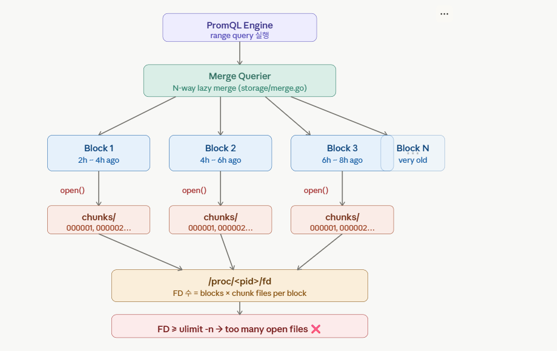

프로메테우스는 3의 배수 법칙(Exponential Buckets)을 따릅니다
.Level 1: 2시간 단위 블록들을 합쳐 6시간 블록을 만듭니다. ($2h \times 3$)
Level 2: 6시간 블록들을 합쳐 18시간 블록을 만듭니다. ($6h \times 3$)
Level 3: 이 과정을 반복하여 최대 31일(또는 전체 보관 기간의 10%)까지 블록 크기를 키웁니다.

LabelNames() 및 LabelValues() : 모든 블록에서 정렬된 레이블 이름과 값들을 가져와 N-way 병합 수행  
Select()를 통한 지연 병합(Lazy Merge)   
각 블록의 시리즈 반복자(Series Iterator)를 가져와 지연(Lazy) N-way 병합 방식으로 결합합니다. 
동시 오픈 상태 유지: 쿼리가 완료될 때까지 모든 관련 블록의 파일(인덱스, 청크 등)에 대한 연결 통로(FD)를 동시에 계속 열어두어야 합니다.
압축을 진행하기 위해 블록의 파일을 열어서 읽고, 병합하고 다시 써야 하기 때문에 굉장히 많은 FD가 발생하게 됩니다.
 

## 튜닝 실습

우선 현재 서버의 fs.file-max 값을 확인해보겠다. 아무것도 건드리지않은 순정 상태인데 말도 안되게 높게 잡혀있는 모습인데,
찾아본 결과 권장되는 값은 메모리를 kb 표현했을 때의 10 프로 수준으로 본 vm이 200,000 내외 라는 것이다.

file-nr은 현재 현재 커널이 할당해서 사용 중인 파일 핸들의 총 개수 / 할당은 되었으나 현재는 사용되지 않고 비어 있는 파일 핸들 수 / 시스템 전체에서 가질 수 있는 최대 파일 핸들 수(fs.file-max)

현재 서버의 ulimit -n 값입니다.

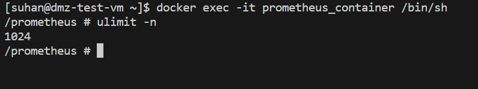

프로메테우스 컨테이너의 ulimit 값입니다.

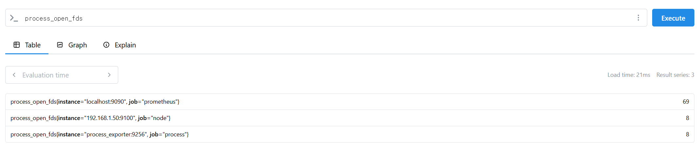

현재 프로메테우스가 열고 있는 FD의 개수입니다.

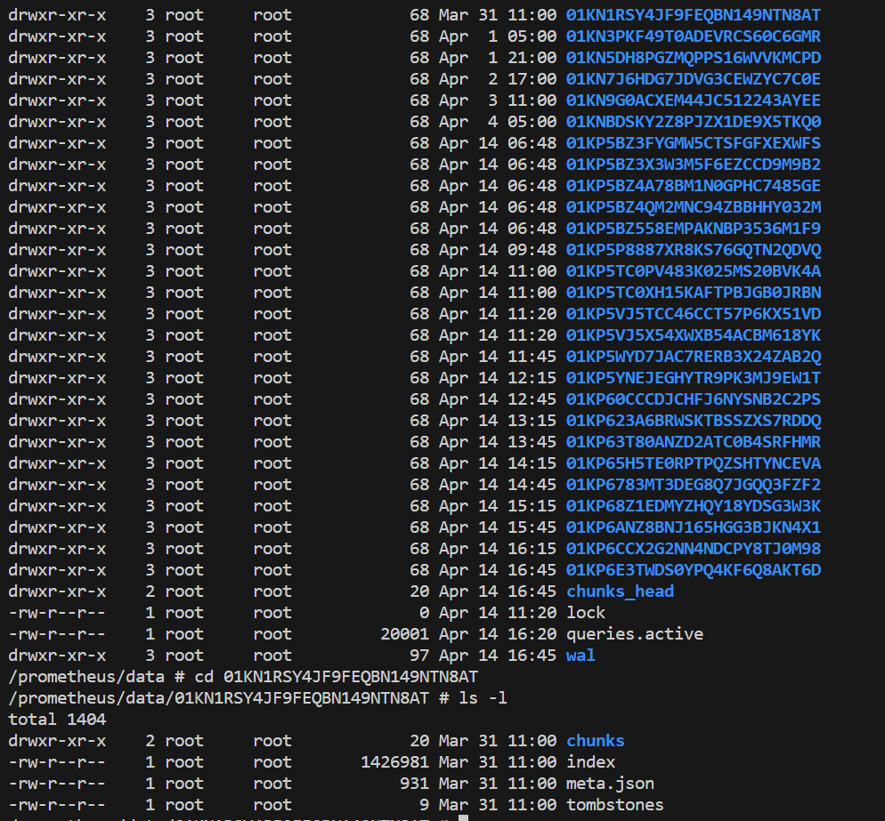

Persisted Blocks 을 확인할 수 있습니다. 해당 블록을에서 프로메테우스가 

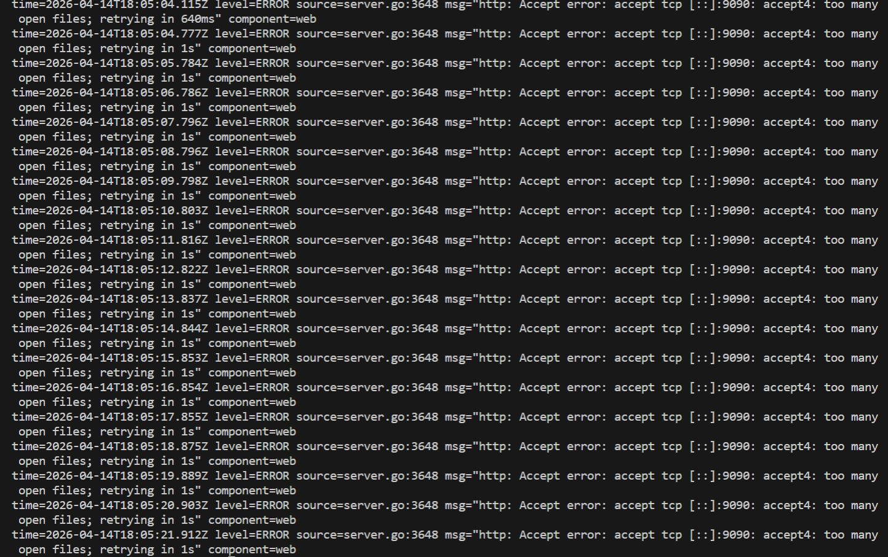

스트레스 테스트에 의하여 프로메테우스 내부의 ulimit 값을 넘어서 FD가 발생하여 too many open files 에러 발생.
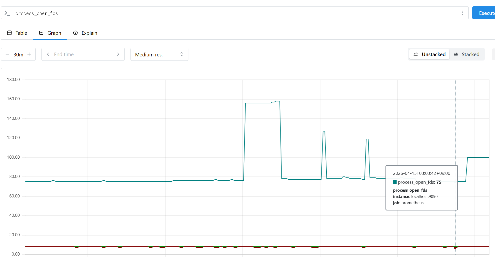

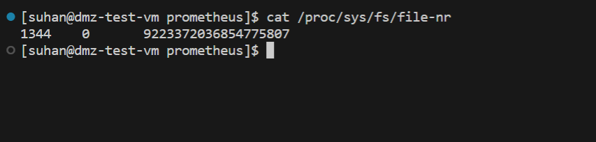

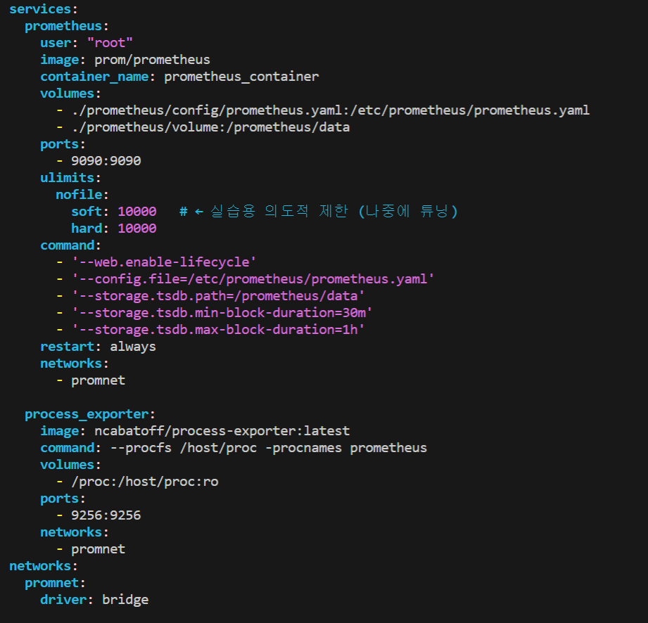  
이제 프로메테우스 컨테이너의 ulimit 값을 10000 으로 늘려보겠습니다.

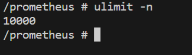  
적용

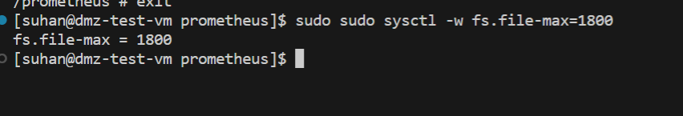    
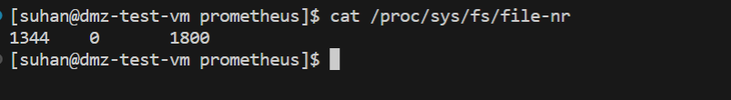 

`sudo sysctl -w fs.file-max`
로 fs.file-max 값을 튜닝해보았습니다. (1800으로 극단적으로 줄였지만 스트레스 테스트가 예상만큼의 fd를 발생시키지 못해서.. 1400으로 줄였습니다.)

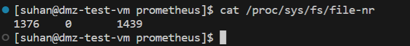

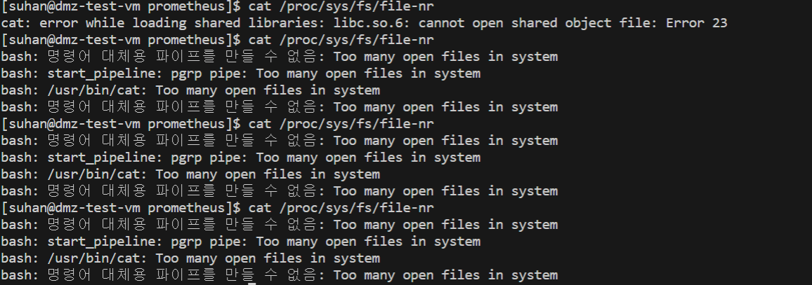

전역 커널 파라미터가 적용되었기 때문에 ulimit 값을 넉넉하게 설정했지만 프로메테우스는 물론이고
시스템 전체에 too many open files 에러가 발생하는 것을 알 수 있다. 호스트 수준에서 
too many open files 에러가 발생하게 되면 기본적인 리눅스의 명령어도 too many open files 에러를
내뱉어 시스템 전체가 마비되는 것을 확인 할 수 있습니다.

### 번외 ulimit를 조정해야 하는이유 와 fs.file-max

튜닝 실습이 예처럼, ulimit와 fs.file-max를 지나치게 낮추면 시스템이 파일을 읽지 못하는 것을 알 수 있습니다.
그럼 어린아이의 시점에서, 그냥 999999999로 설정하면 되는 거 아닐까요? 물론 당연히 안되겠지만 그래도 자세한 이유를 생각해봤습니다.

####  kernerl memory overhead & zombie process
FD 는 단순한 숫자가 아닙니다. FD 하나당 kb 단위의 커널 메모리가 소비됩니다.
만약 프로메테우스의 exporter 버그 등이 발생해서 FD를 닫지 않고 계속 생성하는 leak가 발생했다고 생각했을 때,
ulimit가 적당히 설정되어 있다면 exporter process만 too many open files를 뱉고 시스템은 안전할 것입니다.
하지만 그렇지 않다면 시스템 전체의 장애로도 이어질 수 있습니다. 
또한 zombie process 등이 생겼을 때 해당 제한이 없다면 해당 프로세스가 블랙홀 마냥 모든 메모리를 할당할 것입니다.
모든 것이 file system이라는 철학의 리눅스에서 파일을 열지 못한다는 것은 서버 자체의 마비를 의미하지만, fs-file.max가
제한이 없어 커널의 모든 자원을 좀비프로세스나 버그가 소비해버린 순간 물리적 재부팅말고는 답이 없게 되기 때문에 
linux는 시스템이 부팅될 때마다 커널이 현재 장착된 RAM 용량을 확인하여 동적으로 계산한다고 합니다.

